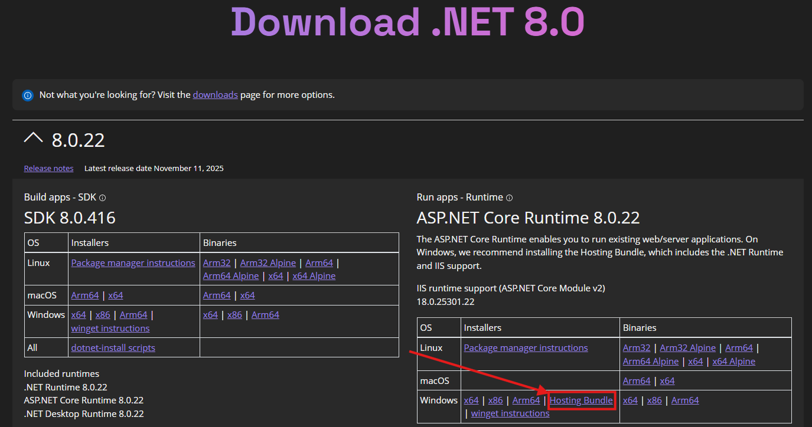

# Deployment Guide - SCALE User Action API

## Prerequisites

- IIS server with **.NET 8 Hosting Bundle** installed
  - Download: https://dotnet.microsoft.com/download/dotnet/8.0
  
  - After installation, run: `iisreset`

### Verify ASP.NET Core Module Installation

After installing the .NET 8 Hosting Bundle, verify the AspNetCoreModuleV2 is properly registered:

1. Open `C:\Windows\System32\inetsrv\Config\applicationHost.config`
2. Verify `<modules>` section contains:
   ```xml
   <add name="AspNetCoreModuleV2" />
   ```
3. Verify `<globalModules>` section contains:
   ```xml
   <add name="AspNetCoreModuleV2" image="%ProgramFiles%\IIS\Asp.Net Core Module\V2\aspnetcorev2.dll" preCondition="bitness64" />
   ```

**Important**: If these entries are missing, manually add them to `applicationHost.config` and run `iisreset`.

### Compatibility with 32-bit Applications

**Warning**: AspNetCoreModuleV2 can break existing 32-bit IIS applications.

If you have 32-bit applications (typically in `Program Files (x86)`), add this to their `web.config`:

```xml
<configuration>
  <system.webServer>
    <modules>
      <remove name="AspNetCoreModuleV2" />
    </modules>
  </system.webServer>
</configuration>
```

This removes the module only for that specific application while keeping it available globally for .NET Core apps.

## Deployment Steps

### 1. Clone Repository in Visual Studio

```powershell
git clone https://github.com/ShutterSeeker/ScaleUserAction.git
cd ScaleUserAction
```

### 2. Configure Connection String (SQL Login)

Update **`appsettings.json`** with your environment details:

```json
{
    "Logging": {
        "LogLevel": {
            "Default": "Warning",
      "Microsoft.AspNetCore": "Warning",
      "ScaleUserAction.RequestDiagnostics": "Information"
        }
    },
    "AllowedHosts": "your-scale-server.com",
    "ConnectionStrings": {
      "DefaultConnection": "Server=YOUR_SQL_SERVER;Database=YOUR_DATABASE;User Id=YOUR_DB_USER;Password=YOUR_PASSWORD;TrustServerCertificate=True;"
    }
}
```

  Update **`web.config`** environment variable (optional - overrides appsettings.json):

```xml
<environmentVariables>
  <environmentVariable name="ASPNETCORE_ENVIRONMENT" value="Production" />
  <environmentVariable name="Logging__LogLevel__ScaleUserAction.RequestDiagnostics" value="Information" />
  <environmentVariable name="ConnectionStrings__DefaultConnection" value="Server=YOUR_SQL_SERVER;Database=YOUR_DATABASE;User Id=YOUR_DB_USER;Password=YOUR_PASSWORD;TrustServerCertificate=True;" />
</environmentVariables>
```

  This deployment uses SQL authentication (`User Id` / `Password`) in the connection string.

  Keep the production connection string in `web.config` so environment-specific credentials are not baked into published app binaries. Restrict NTFS permissions on `web.config` to IIS admins and the app pool identity only.

  Because SQL authentication is used, the IIS app pool identity does **not** need direct SQL login permissions.

### 3. Build and Publish

In Visual Studio:
- Build → **Publish**
- Choose **Folder** profile
- Target location: `C:\Program Files\Manhattan Associates\ILS\2020\Services\UserAction`
- Click **Publish**

### 4. Create IIS Application Pool

1. Application pools → Right-click → **Add Application Pool...**
2. Name: `ScaleUserAction`
3. Right click `ScaleUserAction` → **Advanced settings**
4. Identity → `...`
5. Use **ApplicationPoolIdentity**

With SQL username/password in the connection string, this identity is only for running the app process (file access, logs, process rights), not for SQL authentication.

### 5. Create IIS Application

1. Expand your site → Right-click → **Add Application**
2. Alias: `UserAction`
3. Application pool: `ScaleUserAction`
4. Physical path: `C:\Program Files\Manhattan Associates\ILS\2020\Services\UserAction`

### 6. Configure IIS Authentication

In IIS Manager:
1. Select **UserAction** application
2. Double-click **Authentication**
3. **Enable** Anonymous Authentication
4. **Disable** Windows Authentication

SCALE already sends the acting user in the request headers (for example `Username: bbecker`) along with its bearer token, so enabling IIS Windows Authentication is not required for this app and causes the browser sign-in prompt you saw.

### 7. Grant SQL Server Permissions

Run on your SQL Server and grant permissions to the SQL login used in `ConnectionStrings__DefaultConnection`:

```sql
-- If login already exists, skip CREATE LOGIN / CREATE USER
CREATE LOGIN [YOUR_DB_USER] WITH PASSWORD = 'YOUR_DB_PASSWORD';
USE [YOUR_DATABASE];
CREATE USER [YOUR_DB_USER] FOR LOGIN [YOUR_DB_USER];

ALTER ROLE [db_datareader] ADD MEMBER [YOUR_DB_USER];
ALTER ROLE [db_datawriter] ADD MEMBER [YOUR_DB_USER];
GRANT EXECUTE ON SCHEMA::[dbo] TO [YOUR_DB_USER];
GO
```

### 8. Deploy Stored Procedure

Deploy the SQL objects documented in `SCALE_INTEGRATION.md` (dispatcher + action procedures in `sql/stored-procs`).

### 9. Test Deployment

```powershell
# Test health endpoint
Invoke-WebRequest -Uri "https://your-server/UserAction/health" -UseBasicParsing
```

Check logs at: `C:\Program Files\Manhattan Associates\ILS\2020\Services\UserAction\logs\stdout_*.log`

### Request Diagnostics Logging

The `/ExecProc` endpoint now writes a focused diagnostic log entry showing the safe request details relevant to user resolution:

- HTTP method and path
- query-string key names
- header names present on the request
- `Username` header value
- whether the `UserInformation` cookie exists and what username was parsed from it
- whether an `Authorization` header exists, its scheme, the parsed bearer username, which bearer claim supplied it, the bearer claim names present, and the relevant bearer identity claim values
- `HttpContext.User.Identity` authentication status and identity name
- final resolved request user and final audit user

Raw bearer tokens and raw cookie values are intentionally not written to the log.

To turn this logging on, set `ScaleUserAction.RequestDiagnostics` to `Information` either in `appsettings.json` or through the IIS environment variable shown above. To turn it back off, change that value to `Warning`.

Where logs are written:

- Local Visual Studio / `dotnet run`: the logs go to the terminal or Visual Studio debug output.
- IIS with `stdoutLogEnabled="true"`: the logs are written under the app folder in `logs\stdout_*.log`.

If IIS does not create log files, create the `logs` folder manually and give the application pool identity write permission.

## SCALE Integration

SCALE button/action setup, stored procedure deployment, and SQL automation scripts are documented in `SCALE_INTEGRATION.md`.

See `SCALE_INTEGRATION.md` for:
- Deploying procedures from `sql/stored-procs`
- Using `sql/scripts/create-user-action.sql` and `sql/scripts/remove-user-action.sql`
- Tuning script parameters for your form/action
- Resource key and security permission handling

## Troubleshooting

**500 Error - Database connection failed**
- Verify connection string in web.config
- Verify SQL login/user exists and has required permissions
- Verify SQL password is correct and login is not locked/expired
- Test SQL connection from the IIS server

**Browser sign-in prompt when calling `/UserAction/ExecProc`**
- Verify **Anonymous Authentication** is enabled for the `UserAction` IIS application
- Verify **Windows Authentication** is disabled for the `UserAction` IIS application
- Confirm the request still includes the `Username` header from SCALE

**500.19 Error - AspNetCoreModuleV2 not loaded**
- Open `C:\Windows\System32\inetsrv\Config\applicationHost.config`
- Verify AspNetCoreModuleV2 is in both `<modules>` and `<globalModules>` sections
- Run `iisreset` after making changes

**32-bit applications failing after .NET 8 Hosting Bundle installation**
- Add `<remove name="AspNetCoreModuleV2" />` to affected app's `web.config` under `<system.webServer><modules>`
- This is common for apps in `Program Files (x86)`

**No logs generated**
- Verify `logs` folder exists and has write permissions
- Verify `ScaleUserAction.RequestDiagnostics` is set to `Information`
- Check Windows Event Viewer → Application logs for ASP.NET Core errors

## Production Checklist

- [ ] .NET 8 Hosting Bundle installed on IIS server
- [ ] AspNetCoreModuleV2 verified in `applicationHost.config` (both `<modules>` and `<globalModules>`)
- [ ] 32-bit applications protected with `<remove name="AspNetCoreModuleV2" />` in their `web.config`
- [ ] `appsettings.json` updated with production connection string
- [ ] `web.config` updated with production connection string (if overriding)
- [ ] Application published to `C:\Program Files\Manhattan Associates\ILS\2020\Services\UserAction`
- [ ] IIS Application Pool created with `ApplicationPoolIdentity`
- [ ] IIS Application created under SCALE site
- [ ] Anonymous Authentication enabled, Windows Authentication disabled
- [ ] SQL Server permissions granted to the SQL login used in connection string
- [ ] `usp_UserAction.sql` deployed to database
- [ ] Health endpoint returns `{"status":"ok"}`
- [ ] Test API call succeeds
- [ ] SCALE dialog configured and tested

